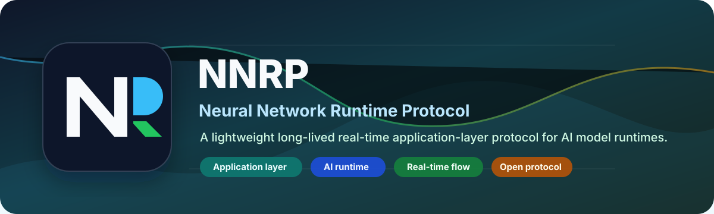

<p align="center">
  
</p>

<p align="center">
  <a href="https://github.com/NagareWorks/vllm-nnrp-adapter/actions"></a>
  <a href="https://www.python.org"></a>
  <a href="https://nagareworks.github.io/nnrp-doc/"></a>
  <a href="https://github.com/NagareWorks/vllm-nnrp-adapter/blob/main/LICENSE"></a>
</p>

# vllm-nnrp-adapter

vLLM adapter for serving the frozen NNRP OpenAI-compatible API profile.

This repository binds vLLM's OpenAI-compatible serving surface to NNRP sessions, result streams, cancellation, diagnostics, and conformance recipes. It is not a second OpenAI HTTP server and it does not redefine vLLM scheduling policy. The adapter owns the translation boundary between OpenAI-compatible request/response objects and NNRP profile events.

## Scope

The first implementation slice targets NNRP `openai-compatible/1` Level 1:

1. `chat.completions.create` request envelopes.
2. Streaming text deltas.
3. Non-streaming completion bodies.
4. Cancellation and timeout mapping.
5. OpenAI-compatible error bodies.
6. Usage summary events.
7. Tool-call event pass-through when vLLM and the selected model expose tool-call data.
8. Capability document generation for SDK feature probes and conformance selection.

Level 2 `responses.create` and Level 3 model discovery / embeddings are explicit follow-up work, not hidden behavior in the Level 1 adapter.

## Supported vLLM Line

The adapter declares compatibility with `vllm>=0.18.0,<0.23`. The first CI baseline should exercise `0.18.1` and the current stable line separately. `0.18.0` remains in the supported range because it is the first version in the selected support band, while `0.18.1` is the preferred lower-bound test target.

## Layout

- `src/vllm_nnrp_adapter/profile.py`: frozen profile constants, request envelope validation, event builders, and capability document helpers.
- `src/vllm_nnrp_adapter/adapter.py`: profile-level async request handler that maps backend responses to NNRP profile events.
- `src/vllm_nnrp_adapter/vllm_backend.py`: vLLM serving-object wrapper and method probing.
- `tests/`: profile and adapter mapping tests that do not require a GPU runtime.
- `doc/todo/v1-preview3/`: preview3 implementation checklist for the adapter.

## Development

```powershell
python -m pip install -e .[dev]
ruff check .
pytest -q
python -m build
```

Install the vLLM extra only in an environment that can actually host vLLM:

```powershell
python -m pip install -e .[dev,vllm]
```

## Minimal Adapter Shape

```python
from vllm_nnrp_adapter import OpenAiNnrpAdapter, OpenAiNnrpCapabilityDocument

capabilities = OpenAiNnrpCapabilityDocument.level1(models=("example-model",))
adapter = OpenAiNnrpAdapter(backend=my_vllm_backend, capabilities=capabilities)

events = [
    event
    async for event in adapter.handle_request(
        {
            "schema_version": "openai-compatible/1",
            "operation": "chat.completions.create",
            "body": {
                "model": "example-model",
                "messages": [{"role": "user", "content": "hello"}],
                "stream": True,
            },
        }
    )
]
```

The adapter consumes and emits JSON-compatible profile objects. The NNRP server integration owns frame submission, result push delivery, and cancellation plumbing.

## Contributors

<a href="https://github.com/NagareWorks/vllm-nnrp-adapter/graphs/contributors" title="Open the contributors graph for individual GitHub profiles and IDs.">
  
</a>

The avatar wall above updates automatically from the repository contributor list.

